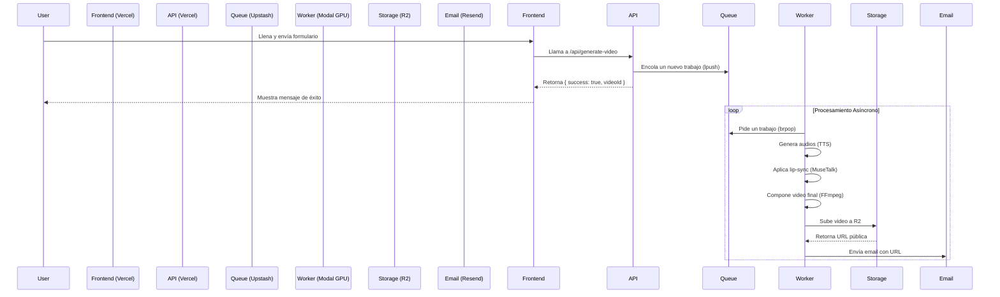

> **Nota:** Este es un proyecto complejo que combina un frontend en Next.js con un backend de procesamiento de video en Python que requiere GPU. La siguiente guía asume conocimientos de ambos ecosistemas.

# Implementación Completa: Grido Fiestas Mágicas

## 1. Arquitectura General

Este proyecto utiliza una arquitectura desacoplada para manejar la alta carga del procesamiento de video de manera eficiente y escalable.

- **Frontend (Next.js en Vercel):** Se encarga de la interfaz de usuario, captura los datos del formulario y se comunica con el backend a través de una API.
- **Cola de Trabajos (Upstash Redis):** Actúa como intermediario. El frontend encola un "trabajo" por cada video a generar.
- **Worker (Python en Modal):** Un servicio serverless con acceso a GPU que toma trabajos de la cola, genera los videos y los sube a un storage.
- **Storage (Cloudflare R2):** Almacena los videos generados y los sirve públicamente.
- **Email (Resend):** Envía el email al usuario con el link al video final.



## 2. Stack Tecnológico Recomendado

| Componente | Servicio | Costo Estimado (10k videos) | Alternativa |
| :--- | :--- | :--- | :--- |
| **Frontend** | [Vercel](https://vercel.com) | $0 - $20/mes | Netlify, Cloudflare Pages |
| **Worker GPU** | [Modal](https://modal.com) | $10 - $20 | RunPod, Vast.ai |
| **Cola (Queue)** | [Upstash Redis](https://upstash.com) | $0 - $5/mes | Aiven, Railway Redis |
| **Storage** | [Cloudflare R2](https://www.cloudflare.com/developer-platform/r2/) | ~$5/mes | AWS S3, Wasabi |
| **Email** | [Resend](https://resend.com) | $0 - $20/mes | SendGrid, Mailgun |
| **Dominio** | - | ~$15/año | - |

**Costo Total Estimado para 10,000 videos: $15 - $70**

## 3. Pasos para la Implementación

### Paso 3.1: Preparar Cuentas y Assets

1.  **Crear Cuentas:**
    -   [GitHub](https://github.com/)
    -   [Vercel](https://vercel.com/signup)
    -   [Modal](https://modal.com/signup) (requiere tarjeta de crédito)
    -   [Upstash](https://console.upstash.com/register)
    -   [Cloudflare](https://dash.cloudflare.com/sign-up)
    -   [Resend](https://resend.com/signup)

2.  **Preparar Assets de Video:**
    Necesitas exportar 3 videos base desde tu archivo de diseño (PSD/AE).

    -   `intro_frames1_2.mp4`
        -   **Contenido:** Animación de intro + Pote vacío.
        -   **Audio:** Sin audio.
        -   **Duración:** ~5-7 segundos.

    -   `frame3_santa_base.mp4`
        -   **Contenido:** Papá Noel estático, mirando a cámara, sin hablar.
        -   **Audio:** Sin audio.
        -   **Duración:** ~15 segundos (debe ser más largo que cualquier diálogo posible).

    -   `outro_frame4.mp4`
        -   **Contenido:** Animación de cierre.
        -   **Audio:** Sin audio.
        -   **Duración:** ~3-5 segundos.

    **Especificaciones para todos los videos:** 1080x1920 (vertical), 25 FPS, H.264, formato `.mp4`.

### Paso 3.2: Configurar el Backend (Worker en Modal)

El worker es el corazón del sistema. Usaremos Modal por su facilidad de uso y su modelo de pago por uso para GPUs.

1.  **Instalar Modal CLI:**
    ```bash
    pip install modal
    ```

2.  **Autenticar Modal:**
    ```bash
    modal token new
    ```
    Sigue las instrucciones en la web.

3.  **Estructura del Proyecto del Worker:**
    ```
    grido-worker/
    ├── modal_worker.py  # Lógica del worker
    ├── assets/          # Directorio para los videos base
    │   ├── intro_frames1_2.mp4
    │   ├── frame3_santa_base.mp4
    │   └── outro_frame4.mp4
    └── requirements.txt
    ```

4.  **Crear `requirements.txt`:**
    ```txt
    redis
    boto3
    requests
    ```

5.  **Crear `modal_worker.py`:**
    Este archivo contendrá una versión adaptada del `video-worker.py` para correr en Modal. La lógica es la misma, pero se empaqueta de forma diferente.

    *(El código completo se adjuntará por separado, pero la estructura clave es la siguiente)*

    ```python
    import modal

    # Define la imagen de Docker con las dependencias
    image = modal.Image.debian_slim(python_version="3.11") \
        .pip_install_from_requirements("requirements.txt") \
        .apt_install("ffmpeg") \
        .run_commands(
            "pip install torch torchvision torchaudio --index-url https://download.pytorch.org/whl/cu118",
            "pip install git+https://github.com/TMElyralab/MuseTalk.git"
        )

    # Define el stub de la app de Modal
    stub = modal.Stub("grido-video-worker")

    # Define la función que se ejecutará en la GPU
    @stub.function(
        image=image,
        gpu="T4", # o "A10G" para más potencia
        secrets=[modal.Secret.from_name("grido-secrets")],
        timeout=300 # 5 minutos
    )
    def process_video_job(video_id: str):
        # ... toda la lógica de process_video() va aquí ...
        # (generar TTS, lip-sync, FFmpeg, S3, Resend)
        pass

    # Función principal que escucha la cola de Redis
    @stub.local_entrypoint()
    def main():
        # ... loop que llama a redis.brpop y dispara process_video_job.remote(video_id) ...
        pass
    ```

6.  **Configurar Secretos en Modal:**
    En la UI de Modal, crea un grupo de secretos llamado `grido-secrets` con las siguientes variables:
    -   `UPSTASH_REDIS_REST_URL`
    -   `UPSTASH_REDIS_REST_TOKEN`
    -   `AWS_ACCESS_KEY_ID` (para R2)
    -   `AWS_SECRET_ACCESS_KEY` (para R2)
    -   `AWS_ENDPOINT_URL` (para R2, ej: `https://<account_id>.r2.cloudflarestorage.com`)
    -   `S3_BUCKET`
    -   `RESEND_API_KEY`

### Paso 3.3: Configurar el Frontend (Next.js en Vercel)

1.  **Subir el código a GitHub:**
    Sube el código de tu proyecto `grido-fiestas-magicas-main` a un nuevo repositorio en GitHub.

2.  **Crear Proyecto en Vercel:**
    -   Importa el repositorio de GitHub en Vercel.
    -   Vercel detectará que es un proyecto Next.js y lo configurará automáticamente.

3.  **Actualizar el Código del Frontend:**
    -   Reemplaza el contenido de `src/app/actions/sendGreeting.ts` con el código de `sendGreeting-UPDATED.ts` que te proporcioné.
    -   Este nuevo código ya no simula el envío, sino que llama a tu API externa.

4.  **Crear la API Route (Opcional, si no usas una API externa):**
    Si prefieres que la lógica de encolar el trabajo esté en el mismo proyecto de Next.js, crea el archivo `src/app/api/generate-video/route.ts` con el código que te pasé.

5.  **Configurar Variables de Entorno en Vercel:**
    En la configuración de tu proyecto en Vercel, añade las siguientes variables:
    -   `UPSTASH_REDIS_REST_URL`
    -   `UPSTASH_REDIS_REST_TOKEN`
    -   `VIDEO_API_SECRET`: Una clave secreta que tú inventes para proteger tu API.

### Paso 3.4: Puesta en Marcha

1.  **Deploy del Worker:**
    Desde tu terminal, en el directorio `grido-worker`:
    ```bash
    modal deploy modal_worker.py
    ```
    Esto subirá tu código a Modal y lo dejará corriendo, esperando trabajos en la cola de Redis.

2.  **Deploy del Frontend:**
    Cada vez que hagas `git push` a la rama principal de tu repositorio en GitHub, Vercel hará un deploy automático.

3.  **Prueba End-to-End:**
    -   Abre tu landing page en la URL de Vercel.
    -   Llena el formulario y envíalo.
    -   Monitorea los logs en Vercel (para la llamada a la API) y en Modal (para el procesamiento del video).
    -   En unos minutos, deberías recibir el email con el video.

## 4. Consideraciones Adicionales

-   **Modelos de IA:** El código del worker asume que tienes los modelos de TTS (Kokoro) y Lip-Sync (MuseTalk) listos para ser usados. La imagen de Docker en Modal se encargará de instalar las dependencias, pero necesitarás adaptar las rutas y los comandos de inferencia a tu implementación específica.
-   **Manejo de Errores:** El worker actual tiene un manejo básico de errores. En producción, deberías implementar un sistema de reintentos (ej. con `retries` en Modal) y notificaciones si un trabajo falla repetidamente.
-   **Escalabilidad:** La arquitectura propuesta es altamente escalable. Vercel escala automáticamente. Modal puede manejar miles de trabajos en paralelo (dependiendo de tu presupuesto). Upstash y R2 también son serverless y escalan sin problemas.
-   **Costos:** Monitorea de cerca tus costos en Modal y Cloudflare, especialmente durante las primeras pruebas y el lanzamiento de la campaña.

--- 
*Esta guía fue preparada por Manus AI. Última actualización: 29 de Noviembre, 2025.*
